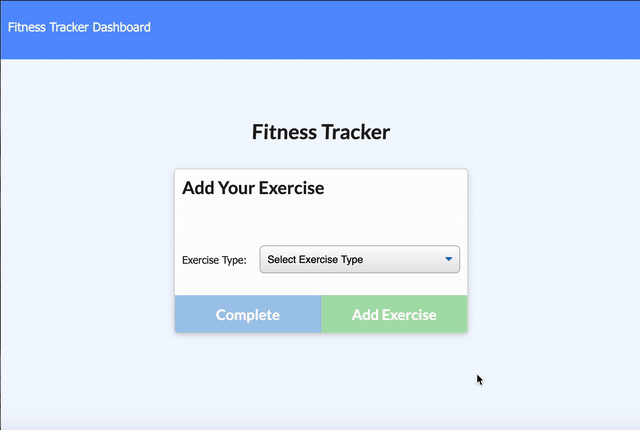

# Workout Manager

Allows you to keep track of different types of excersises and add them to different workouts. Uses Charts.js to display the statistics to the stats page. 

## Images


## Deployment
* [Live Site](https://yourworkouttracker.herokuapp.com/)
* [Repository](https://github.com/boundsalexis/workout-manager)

## Built With

* [HTML](https://developer.mozilla.org/en-US/docs/Web/HTML)
* [CSS](https://developer.mozilla.org/en-US/docs/Web/CSS)
* [Bootstrap](https://getbootstrap.com/)
* [Javascript](https://www.javascript.com/)
* [Node.js](https://nodejs.org/en/)
* [Express](https://www.npmjs.com/package/express)
* [MongoDB](https://www.mongodb.com/)


## Code Excerpt
```Javascript
 // gets all workouts back
    app.get("/api/workouts", (req, res) => {
        var total = 0;
        // find all workouts in db (an array)
        db.Workout.find({}).then(Workoutdb => {
           // iterate through array for each workout and add up their time
            Workoutdb.forEach(workout => {
                workout.exercises.forEach(exercises => {
                    total += exercises.duration;
                });
                // set total workout time to the time we just added up
                workout.totalDuration = total;
            });
            //send json of all workouts back
            res.json(Workoutdb);
        }).catch(err => {
            res.json(err);
        });
    });
```
This is one of our API routes. It find to total workout time and sends the JSON of every single workout back. 

## Installation
1. Clone the repository down
2. Run NPM install
3. Run node server.js

## Authors

* **Alexis Bounds** 
* [Portfolio](https://alexisboundsportfolio.herokuapp.com/)
* [Github Profile](https://github.com/boundsalexis)
* [LinkedIn Profile](https://linkedin.com/in/boundsalexis)


## License

This project is licensed under the MIT License - see the [LICENSE.md](LICENSE.md) file for details